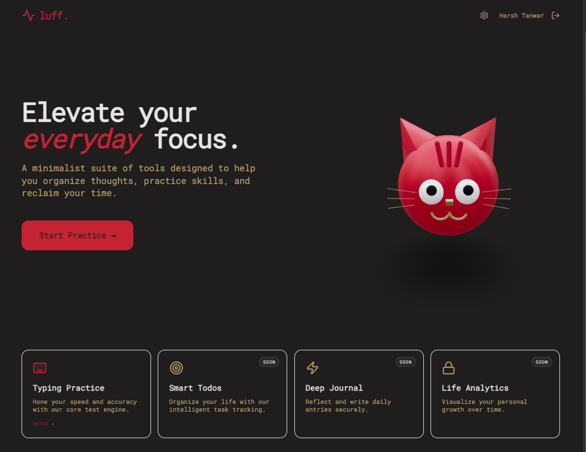

<div align="center">

# 🐱 luff.

### *Elevate your everyday focus.*

> A minimalist productivity workspace that turns discipline into delight.
> Type faster. Think clearer. Stay focused.

**[✨ Live Demo →](https://luff-everyday.vercel.app/)** &nbsp;|&nbsp; **[🐛 Report Bug](https://github.com/Luff-Org/luff-everyday/issues)** &nbsp;|&nbsp; **[💡 Request Feature](https://github.com/Luff-Org/luff-everyday/issues)**

</div>

---

<div align="center">
  
  <br />
  <sub>Homepage featuring a theme-reactive 3D cat mascot that tracks your cursor and reacts to clicks 🐾</sub>
</div>

---

## 🧠 Why luff?

Most productivity tools feel like work. **luff.** flips the script — it's a workspace you *want* to open. With an interactive 3D mascot that follows your eyes, 31 handcrafted color themes, and a typing engine built for flow state, it's productivity wrapped in personality.

**This isn't another boring tool. This is your new daily ritual.**

---

## 🔥 Features at a Glance

<table>
<tr>
<td width="50%">

### ⌨️ Elite Typing Engine
- **Real-time metrics** — WPM, raw WPM, accuracy %, all updating live
- **Smart caret** — Smooth, character-following cursor with error highlighting
- **Infinite buffer** — Words auto-prefetch, zero interruptions
- **Keyboard-first** — `Shift+Enter` restart, `Esc` reset, no mouse needed

</td>
<td width="50%">

### 🐱 Interactive 3D Mascot
- **Eye tracking** — Pupils follow your cursor in real-time
- **Whisker twitching** — Micro-animations for lifelike feel
- **Click reactions** — Tap the cat for a "bonk" face 😿
- **Hover purring** — Subtle vibration on hover
- **Theme-reactive** — Colors shift with your chosen palette

</td>
</tr>
<tr>
<td width="50%">

### 🎨 Deep Customization
- **31 aesthetic themes** — *Nord*, *Dracula*, *Vaporwave*, *Matrix*, and more
- **20 font families** — Modern sans-serifs, classic serifs, playful displays
- **Dynamic branding** — Favicon, UI, and mascot adapt to your palette
- **Persistent settings** — Your preferences saved locally

</td>
<td width="50%">

### 📊 Progress Tracking
- **WPM charts** — Interactive line graphs, speed + mistakes over time
- **Cloud sync** — Results auto-saved via Prisma + PostgreSQL
- **Google OAuth** — One-click login, seamless progress tracking
- **Historical data** — Track growth over days, weeks, months

</td>
</tr>
</table>

---

## 🛠️ Tech Stack

```
Frontend:   Next.js 14 (App Router) + TypeScript
3D Engine:  React Three Fiber + Three.js + @react-three/drei
State:      Zustand (with localStorage persistence)
Styling:    Tailwind CSS + Framer Motion
Database:   PostgreSQL + Prisma ORM
Auth:       NextAuth.js (Google OAuth 2.0)
Charts:     Chart.js
Icons:      Lucide React
Deploy:     Vercel
```

---

## 🚀 Getting Started

### Prerequisites
- Node.js 18+
- PostgreSQL database
- Google OAuth credentials

### 1. Clone & Install
```bash
git clone https://github.com/Luff-Org/luff-everyday.git
cd Luff-Everyday
npm install
```

### 2. Configure Environment
```env
# .env
DATABASE_URL="postgresql://..."
GOOGLE_CLIENT_ID="..."
GOOGLE_CLIENT_SECRET="..."
NEXTAUTH_URL="http://localhost:3000"
NEXTAUTH_SECRET="..."
```

### 3. Initialize Database
```bash
npx prisma generate
npx prisma db push
```

### 4. Run
```bash
npm run dev
```
Open **[localhost:3000](http://localhost:3000)** and start typing.

---

## 🎹 Keyboard Shortcuts

| Key | Action |
| :--- | :--- |
| `Any Key` | Auto-starts the timer |
| `Shift + Enter` | Instant restart |
| `Escape` | Reset test / hide results |
| `Tab` | Next field |

---

## 🎨 Theme Gallery

> 31 themes, from sleek dark modes to vibrant neon aesthetics.
> Every element — from the cat mascot to the favicon — adapts instantly.

Some favorites: **Matrix** · **Nord** · **Dracula** · **Catppuccin** · **Vaporwave** · **Solarized** · **Tokyo Night** · **Gruvbox**

---

## 🐱 Meet the Mascot

The 3D cat isn't just decoration — it's an interactive companion:

- 👀 **Watches you** — Pupils track your mouse position with smooth interpolation
- 😿 **Reacts to bonks** — Click it and it squishes, closes its eyes, and frowns
- 🎨 **Adapts to themes** — Body, ears, whiskers, and stripes all shift color
- ✨ **Subtle animations** — Idle floating, periodic blinking, whisker twitches

Built entirely with procedural Three.js geometry — no external 3D models needed.

---

## 📁 Project Structure

```
src/
├── app/              # Next.js App Router pages
│   ├── page.tsx      # Landing page with 3D mascot
│   ├── typing/       # Typing test engine
│   └── settings/     # Theme & font customization
├── components/
│   ├── 3d/           # Three.js mascot components
│   ├── Header.tsx    # Dynamic header with auth
│   └── ...           # UI components
├── store/            # Zustand state management
└── lib/              # Constants, themes, utilities
```

---

## 🤝 Contributing

Contributions are welcome! Feel free to open issues or submit PRs.

---

## 📜 License

This project is open-source under the [MIT License](LICENSE).

---

<div align="center">
  <br />
  <b>Built with 🐱 and ❤️ by the <a href="https://github.com/Luff-Org">luff.</a> team</b>
  <br />
  <sub>Stop procrastinating. Start typing.</sub>
</div>
