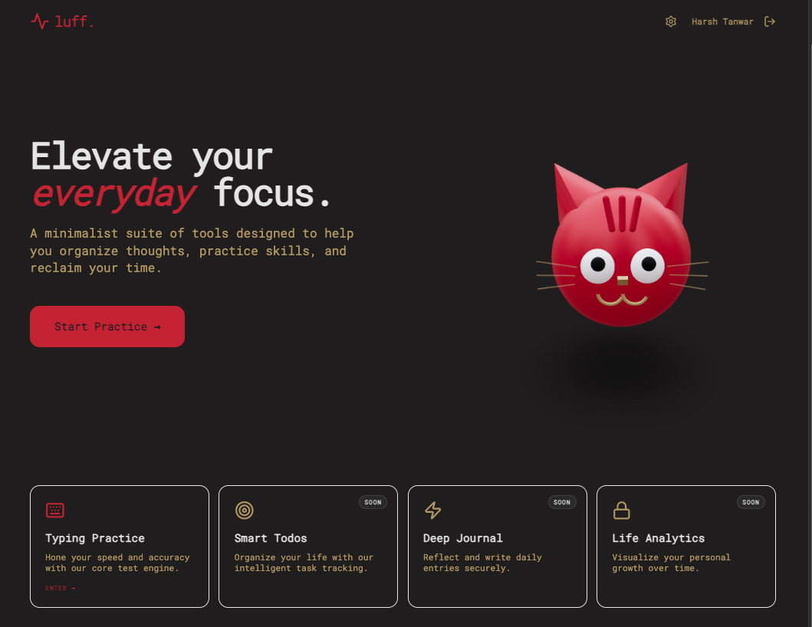

<div align="center">

# 🐱 luff.

### *Elevate your everyday focus.*

> A minimalist productivity workspace that turns discipline into delight.
> Type faster. Think clearer. Stay focused.

**[✨ Live Demo →](https://luff-everyday.vercel.app/)** &nbsp;|&nbsp; **[📚 Docs](docs/README.md)** &nbsp;|&nbsp; **[🐛 Report Bug](https://github.com/Luff-Org/luff-everyday/issues)** &nbsp;|&nbsp; **[💡 Request Feature](https://github.com/Luff-Org/luff-everyday/issues)**

</div>

---

<div align="center">
  
  <br />
  <sub>Homepage featuring a theme-reactive 3D cat mascot that tracks your cursor and reacts to clicks 🐾</sub>
</div>

---

## 🧠 Why luff?

Most productivity tools feel like work. **luff.** flips the script — it's a workspace you *want* to open. With an interactive 3D mascot that follows your eyes, 32 handcrafted color themes, and a typing engine built for flow state, it's productivity wrapped in personality.

**This isn't another boring tool. This is your new daily ritual.**

---

## 🔥 Features at a Glance

<table>
<tr>
<td width="50%">

### ⌨️ Elite Typing Engine
- **Real-time metrics** — WPM, raw WPM, accuracy %, all updating live
- **Smart caret** — Smooth, character-following cursor with error highlighting
- **Infinite buffer** — Words auto-prefetch, zero interruptions
- **Keyboard-first** — `Shift+Enter` restart, `Esc` reset, no mouse needed

</td>
<td width="50%">

### 🐱 Interactive 3D Mascot
- **Eye tracking** — Pupils follow your cursor in real-time
- **Whisker twitching** — Micro-animations for lifelike feel
- **Click reactions** — Tap the cat for a "bonk" face 😿
- **Hover purring** — Subtle vibration on hover
- **Theme-reactive** — Colors shift with your chosen palette

</td>
</tr>
<tr>
<td width="50%">

### 🎨 Deep Customization
- **32 aesthetic themes** — *Nord*, *Dracula*, *Vaporwave*, *Matrix*, and more
- **20 font families** — Modern sans-serifs, classic serifs, playful displays
- **Dynamic branding** — Favicon, UI, and mascot adapt to your palette
- **Persistent settings** — Your preferences saved locally

</td>
<td width="50%">

### 📊 Progress Tracking
- **WPM charts** — Interactive line graphs, speed + mistakes over time
- **Cloud sync** — Results auto-saved via Prisma + PostgreSQL
- **Google OAuth** — One-click login, seamless progress tracking
- **Historical data** — Track growth over days, weeks, months

</td>
</tr>
<tr>
<td width="50%">

### ✅ Smart Todos
- **Quick add** — `write docs tomorrow !high #docs` parses date, priority, tags
- **Task detail** — Notes, estimates, energy level, context, location, links
- **Blockers** — Task dependencies with cycle detection and a completion gate
- **Recurrence** — Daily/weekly/monthly tasks that respawn on completion

</td>
<td width="50%">

### 👤 Profile Dashboard
- **Typing stats** — Best/average WPM, accuracy, best per test duration
- **Todo stats** — Completion rate, overdue, due today, breakdown by priority
- **7-day activity** — Completions per day, zero-filled
- **Streamed** — Server-rendered shell, panels stream in as queries resolve

</td>
</tr>
</table>

---

## 🛠️ Tech Stack

```
Frontend:   Next.js 16 (App Router) + React 19 + TypeScript
3D Engine:  React Three Fiber + Three.js + @react-three/drei
State:      Zustand (with localStorage persistence)
Styling:    Tailwind CSS + Framer Motion
Database:   PostgreSQL (Neon) + Prisma ORM
Auth:       NextAuth v5 / Auth.js (Google OAuth 2.0 + credentials)
Validation: Zod
Charts:     Chart.js
Icons:      Lucide React
Tests:      Vitest
Deploy:     Vercel
```

---

## 🚀 Getting Started

### Prerequisites
- Node.js 20+
- PostgreSQL database
- Google OAuth credentials

### 1. Clone & Install
```bash
git clone https://github.com/Luff-Org/luff-everyday.git
cd Luff-Everyday
npm install
```

### 2. Configure Environment
```env
# .env  (copy from .env.example)
DATABASE_URL="postgresql://user:pw@host-pooler/db?sslmode=require"   # pooled, runtime
DIRECT_URL="postgresql://user:pw@host/db?sslmode=require"            # unpooled, migrations
NEXTAUTH_URL="http://localhost:3000"
NEXTAUTH_SECRET="..."
GOOGLE_CLIENT_ID="..."        # optional — credentials login works without it
GOOGLE_CLIENT_SECRET="..."
```

### 3. Initialize Database
```bash
npx prisma migrate deploy   # apply the migration baseline
```
`prisma generate` already ran via `postinstall`. Never use `db push` here — this repo has a
migration history. See **[docs/database.md](docs/database.md)**.

### 4. Run
```bash
npm run dev
```
Open **[localhost:3000](http://localhost:3000)** and start typing.

### 5. Verify
```bash
npm test && npm run lint && npm run build
npm run smoke      # end-to-end API check against the running dev server
```

---

## 🎹 Keyboard Shortcuts

| Key | Action |
| :--- | :--- |
| `Any Key` | Auto-starts the timer |
| `Shift + Enter` | Instant restart |
| `Escape` | Reset test / hide results |
| `Tab` | Next field |

---

## 🎨 Theme Gallery

> 32 themes, from sleek dark modes to vibrant neon aesthetics.
> Every element — from the cat mascot to the favicon — adapts instantly.

Some favorites: **Matrix** · **Nord** · **Dracula** · **Monokai** · **Vaporwave** · **Gruvbox** · **Superuser** · **Red Samurai**

---

## 🐱 Meet the Mascot

The 3D cat isn't just decoration — it's an interactive companion:

- 👀 **Watches you** — Pupils track your mouse position with smooth interpolation
- 😿 **Reacts to bonks** — Click it and it squishes, closes its eyes, and frowns
- 🎨 **Adapts to themes** — Body, ears, whiskers, and stripes all shift color
- ✨ **Subtle animations** — Idle floating, periodic blinking, whisker twitches

Built entirely with procedural Three.js geometry — no external 3D models needed.

---

## 📁 Project Structure

Feature-based: `src/app` is routing only, features own their components/state/server code.

```
src/
├── app/                 # Next.js App Router — thin pages + API routes
│   ├── page.tsx         #   landing page with 3D mascot
│   ├── typing/ todos/ profile/ settings/ login/
│   └── api/             #   route handlers: validate → service → respond
├── features/
│   ├── typing/          # engine store, metrics, words, server (repo+service)
│   ├── todos/           # store, api client, server, validation, types, lib
│   ├── profile/         # dashboard + panels + charts
│   └── auth/            # NextAuth instance, edge-safe config, register service
├── shared/
│   ├── components/      # Header, UserMenu, Providers, ThemeProvider, 3d/
│   ├── ui/              # generic presentational
│   ├── store/           # theme + font (localStorage-persisted)
│   └── lib/             # prisma, http helpers, constants, hooks
└── proxy.ts             # middleware (Next 16 naming) — guards /todos, /profile
docs/                    # architecture, data model, API contracts, …
prisma/                  # schema.prisma + migrations
scripts/smoke-api.mjs    # end-to-end API smoke test
```

Details: **[docs/architecture.md](docs/architecture.md)**.

---

## 📚 Documentation

| Page | Contents |
| :--- | :--- |
| [docs/architecture.md](docs/architecture.md) | Layering rules, request lifecycle, import boundaries |
| [docs/data-model.md](docs/data-model.md) | ER diagram, every table/column/index/cascade |
| [docs/api-contracts.md](docs/api-contracts.md) | Every endpoint: schema, responses, status codes |
| [docs/auth.md](docs/auth.md) | NextAuth v5 setup, providers, guarding |
| [docs/frontend.md](docs/frontend.md) | Pages, stores, optimistic updates, theming |
| [docs/database.md](docs/database.md) | Migrations, reset, Neon troubleshooting |
| [docs/development.md](docs/development.md) | Setup, conventions, adding a feature |
| [docs/testing.md](docs/testing.md) | Unit suite + smoke test |
| [docs/features/](docs/features/) | Per-feature domain rules |

---

## 🤝 Contributing

Contributions are welcome! Feel free to open issues or submit PRs.

---

## 📜 License

This project is open-source under the [MIT License](LICENSE).

---

<div align="center">
  <br />
  <b>Built with 🐱 and ❤️ by the <a href="https://github.com/Luff-Org">luff.</a> team</b>
  <br />
  <sub>Stop procrastinating. Start typing.</sub>
</div>
