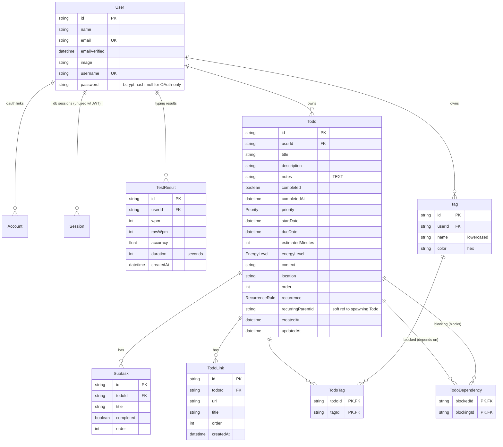

# Data model

Owns: every table, column, enum, index, and cascade rule. Source of truth is
`prisma/schema.prisma`; the SQL baseline is `prisma/migrations/20260725124525_init/migration.sql`.

Provider: PostgreSQL (Neon). All ids are `cuid()` strings unless noted. Prisma model names
map 1:1 to quoted PascalCase table names (`"Todo"`, `"TodoTag"`, …).

## ER diagram

## Enums

| Enum | Values | Used by |
| :--- | :--- | :--- |
| `Priority` | `LOW`, `MEDIUM`, `HIGH`, `URGENT` | `Todo.priority` (default `MEDIUM`) |
| `RecurrenceRule` | `NONE`, `DAILY`, `WEEKLY`, `MONTHLY` | `Todo.recurrence` (default `NONE`) |
| `EnergyLevel` | `LOW`, `MEDIUM`, `HIGH` | `Todo.energyLevel` (nullable) |

## Auth tables

Standard Auth.js/`@auth/prisma-adapter` shape, plus two columns for credentials login.

### `User`

| Column | Type | Notes |
| :--- | :--- | :--- |
| `id` | `String` PK | `cuid()` |
| `name` | `String?` | from Google profile |
| `email` | `String?` **unique** | login identity for OAuth |
| `emailVerified` | `DateTime?` | adapter-managed |
| `image` | `String?` | avatar URL |
| `username` | `String?` **unique** | credentials login identity; lowercased, `^[a-z0-9_]{3,20}$` |
| `password` | `String?` | bcrypt hash, cost 12. `null` ⇒ OAuth-only account |

Relations: `accounts`, `sessions`, `testResults`, `todos`, `tags` — all `onDelete: Cascade`
from the child side, so deleting a user erases every trace of their data.

### `Account`

OAuth links. Columns: `id`, `userId`, `type`, `provider`, `providerAccountId`,
`refresh_token`/`access_token`/`id_token` (`@db.Text`), `expires_at`, `token_type`, `scope`,
`session_state`. Unique on `(provider, providerAccountId)`. Snake-case token columns are the
adapter's contract — do not rename.

### `Session`

`id`, `sessionToken` (unique), `userId`, `expires`. Present because the adapter defines it;
**unused at runtime** since the session strategy is JWT (see [auth.md](auth.md)).

### `VerificationToken`

`identifier`, `token` (unique), `expires`; unique on `(identifier, token)`. No PK — Prisma
models it with a compound unique. Unused today (no email provider configured).

## Todo domain

### `Todo`

| Column | Type | Default | Notes |
| :--- | :--- | :--- | :--- |
| `id` | `String` PK | `cuid()` | |
| `title` | `String` | — | 1–500 chars enforced by Zod |
| `description` | `String?` | — | ≤2000 chars |
| `notes` | `String? @db.Text` | — | ≤20000 chars, long-form body |
| `completed` | `Boolean` | `false` | |
| `completedAt` | `DateTime?` | — | set on complete, cleared on un-complete |
| `priority` | `Priority` | `MEDIUM` | |
| `startDate` | `DateTime?` | — | when work should begin |
| `dueDate` | `DateTime?` | — | drives urgency buckets and stats |
| `estimatedMinutes` | `Int?` | — | 0 … 43200 (30 days) |
| `energyLevel` | `EnergyLevel?` | — | planning hint |
| `context` | `String?` | — | ≤120 chars, e.g. `@computer` |
| `location` | `String?` | — | ≤120 chars |
| `order` | `Int` | `0` | manual sort position, set via reorder |
| `recurrence` | `RecurrenceRule` | `NONE` | |
| `recurringParentId` | `String?` | — | id of the todo whose completion spawned this one. **Soft reference** — no FK, so deleting the parent leaves it dangling by design |
| `createdAt` | `DateTime` | `now()` | |
| `updatedAt` | `DateTime` | `@updatedAt` | |
| `userId` | `String` FK → `User.id` | — | `onDelete: Cascade` |

Index: `@@index([userId, completed, dueDate])` — covers the list/filter/stats access
pattern (a user's open todos ordered or filtered by due date).

### `Subtask`

`id`, `title`, `completed` (`false`), `order` (`0`), `todoId` FK → `Todo` cascade.
No index beyond the FK; subtask counts per todo are small.

### `TodoLink`

Attached reference URLs. `id`, `url`, `title?`, `order` (`0`), `createdAt`, `todoId` FK
cascade. Indexed on `todoId`. Zod caps: `url` ≤2000 chars and must parse as a URL, `title`
≤200 chars, ≤50 links per todo. Writes are **full replacement** (delete-all + createMany in
one transaction), so `order` is the array index of the submitted list.

### `TodoDependency`

Self-relation join table: "`blocked` waits on `blocking`".

| Column | Notes |
| :--- | :--- |
| `blockedId` | FK → `Todo.id` cascade — the task that is blocked |
| `blockingId` | FK → `Todo.id` cascade — the task that must finish first |

Composite PK `(blockedId, blockingId)` prevents duplicate edges; index on `blockingId` makes
the reverse lookup ("what does this task block?") cheap. Cycles are **not** enforceable in
SQL — the service runs a DFS reachability check before writing and rejects with 409. Self
edges are filtered out server-side. Max 50 blockers per todo.

### `Tag` / `TodoTag`

`Tag`: `id`, `name`, `color` (hex), `userId` FK cascade, **unique `(userId, name)`** — tags
are per-user, names are normalized to trimmed lowercase (≤30 chars). Color is auto-assigned
from a fixed 10-colour palette by hashing the name (`features/todos/lib/tagColors.ts`).

`TodoTag`: composite PK `(todoId, tagId)`, both FKs cascade. Tag assignment on update is
full replacement: `deleteMany` on the todo's links, then `upsert` each tag and create links.

## Typing domain

### `TestResult`

| Column | Type | Notes |
| :--- | :--- | :--- |
| `id` | `String` PK | |
| `wpm` | `Int` | net WPM (correct chars / 5 / minutes) |
| `rawWpm` | `Int` | includes incorrect chars |
| `accuracy` | `Float` | 0–100 |
| `duration` | `Int` | test length in seconds (15/30/60/120) |
| `createdAt` | `DateTime` | `now()` |
| `userId` | `String` FK → `User` | cascade |

No extra index — queries are always `where userId` with small per-user row counts
(aggregate, `groupBy duration`, latest 30 for the trend chart).

## Cascade summary

Deleting a `User` removes: `Account`, `Session`, `TestResult`, `Todo`, `Tag` rows. Deleting a
`Todo` removes its `Subtask`, `TodoLink`, `TodoTag`, and every `TodoDependency` edge on either
side. Deleting a `Tag` removes its `TodoTag` links. Nothing else is reachable, so a user
delete is a complete erase.

## Invariants not expressible in the schema

Enforced in `todo.service.ts` / `test.service.ts` — keep them there, not in components:

1. **Ownership** — every mutation first resolves the row via `findOwned(id, userId)`; a miss
   is a 404, never a 403 (no existence leak).
2. **No dependency cycles** — DFS over existing edges before writing; 409 on violation.
3. **Completion gate** — a todo with any incomplete blocker cannot be completed (409).
4. **Recurrence spawn** — completing a recurring todo creates the next occurrence in the same
   transaction, cloning subtasks (reset to incomplete) and tag links, with
   `recurringParentId` pointing back.
5. **`completedAt` coherence** — set to `now()` when `completed` flips true, `null` when false.
6. **Tag identity** — `(userId, lowercased name)`; the same name never yields two tags.
